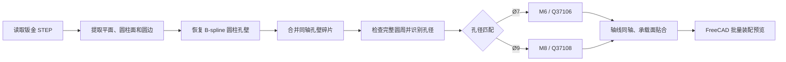

# 焊接螺母批量识别与装配技术报告

## 1. 项目目标

从 `5100541001.stp` 钣金件中自动识别目标圆孔，并装配对应的焊接螺母：

| 圆孔直径 | 螺母规格 | 螺母模型 |
|---|---|---|
| Ø7 mm | M6 | `Q37106.stp` |
| Ø9 mm | M8 | `Q37108.stp` |

`5100540001-ASSY.stp` 是已有装配结果参考，不参与当前算法计算。

## 2. 技术流程

## 3. 核心算法

### 3.1 圆孔识别

程序使用 FreeCAD Part API 遍历 B-Rep 面，提取圆柱半径、轴线、面积和轴向范围。对于被 STEP 导出为 B-spline 的孔壁，通过边界采样拟合上下圆边，恢复其圆柱参数。

同一孔被拆成多个曲面时，按半径接近、轴线平行且共线进行合并。合并后的圆周覆盖必须接近 $2\pi$，从而排除长圆槽端部等局部圆柱面。

孔径按固定尺寸规则分类，直径允许约 ±0.5 mm 的误差：

$$
d=2r
$$

$$
d\approx 7\text{ mm}\Rightarrow M6,\qquad
d\approx 9\text{ mm}\Rightarrow M8
$$

### 3.2 板材装配侧判断

用户选择一个钣金平面作为装配侧参考。程序估算板厚，移除孔壁和厚度边面，再通过面邻接关系划分钣金正反两侧，并选择参考侧的孔口平面。

### 3.3 螺母装配

程序从螺母 STEP 中提取中心轴、焊点所在端和焊接承载面，然后计算两项约束：

1. 螺母中心轴与目标孔轴同轴；
2. 螺母承载面与目标孔口平面重合。

先将螺母轴旋转到板材内部方向，再将螺母装配原点平移到孔口中心，最终生成 FreeCAD `Placement` 并批量复制螺母模型。

## 4. 结论

该方案是一套面向固定孔径和指定螺母库的规则化批量装配系统。其优点是结果可解释、无需训练、对 Ø7/Ø9 标准圆孔定位明确；局限是规格与容差需要人工配置，对非圆孔、严重几何缺损或新增螺母规格需要扩展规则，不支持区分盲孔和通孔。
